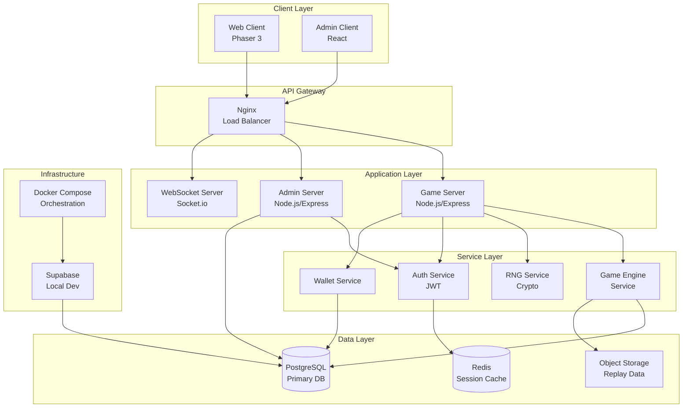

```mermaid
graph TB
    subgraph "Client Layer"
        WC[Web Client<br/>Phaser 3]
        AC[Admin Client<br/>React]
    end
    
    subgraph "API Gateway"
        NG[Nginx<br/>Load Balancer]
    end
    
    subgraph "Application Layer"
        GS[Game Server<br/>Node.js/Express]
        AS[Admin Server<br/>Node.js/Express]
        WS[WebSocket Server<br/>Socket.io]
    end
    
    subgraph "Service Layer"
        GE[Game Engine<br/>Service]
        RNG[RNG Service<br/>Crypto]
        AUTH[Auth Service<br/>JWT]
        WALLET[Wallet Service]
    end
    
    subgraph "Data Layer"
        PG[(PostgreSQL<br/>Primary DB)]
        REDIS[(Redis<br/>Session Cache)]
        S3[Object Storage<br/>Replay Data]
    end
    
    subgraph "Infrastructure"
        DOCKER[Docker Compose<br/>Orchestration]
        SUPABASE[Supabase<br/>Local Dev]
    end
    
    WC --> NG
    AC --> NG
    NG --> GS
    NG --> AS
    NG --> WS
    
    GS --> GE
    GS --> RNG
    GS --> AUTH
    GS --> WALLET
    
    AS --> AUTH
    AS --> PG
    
    GE --> PG
    AUTH --> REDIS
    WALLET --> PG
    GE --> S3
    
    DOCKER --> SUPABASE
    SUPABASE --> PG
```

