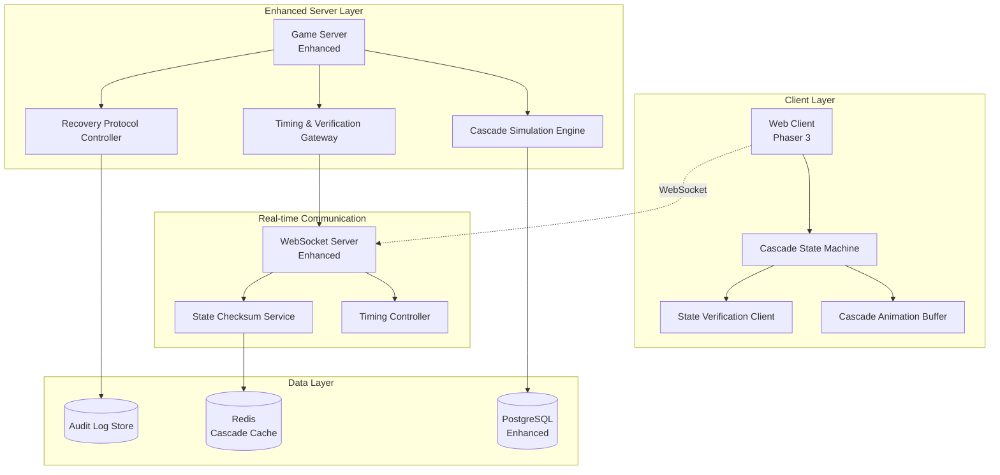

# Enhanced Cascade Synchronization Technical Design

## Executive Summary

This document provides the complete technical blueprint for enhancing the existing client-server architecture with bulletproof cascade synchronization. The design extends the current CLIENT_SERVER_SEPARATION_PLAN.md to ensure perfect timing control and state management during complex multi-cascade sequences while maintaining security and performance.

## Architecture Overview



## Enhanced API Specifications

### Spin Response with Cascade Timing Data

```typescript
interface EnhancedSpinResponse {
    spin_id: string;
    initial_grid: Symbol[][];
    
    // Enhanced cascade data with precise timing
    cascade_sequence: CascadeSequence;
    
    // State verification
    verification_checkpoints: VerificationCheckpoint[];
    
    // Performance controls
    performance_settings: PerformanceSettings;
    
    // Final results
    total_win: number;
    credits_balance: number;
    game_state: GameState;
}

interface CascadeSequence {
    total_cascades: number;
    max_cascades: number; // 8-10 based on requirements
    base_timing: TimingConfiguration;
    cascades: EnhancedCascade[];
}

interface EnhancedCascade {
    cascade_index: number;
    
    // Grid state
    pre_cascade_grid: Symbol[][];
    post_cascade_grid: Symbol[][];
    
    // Win data
    winning_clusters: Cluster[];
    win_amount: number;
    multipliers_applied: MultiplierData[];
    
    // Symbol movement
    symbol_movements: SymbolMovement[];
    drop_sequences: DropSequence[];
    
    // Animation timing
    timing_data: CascadeTiming;
    
    // State verification
    state_checksum: string;
    verification_point: VerificationCheckpoint;
}

interface SymbolMovement {
    symbol_id: string;
    from_position: GridPosition;
    to_position: GridPosition;
    movement_type: 'drop' | 'settle' | 'appear';
    timing_offset: number; // milliseconds from cascade start
    duration: number; // animation duration
    easing: EasingFunction;
    physics_params: PhysicsParameters;
}

interface DropSequence {
    column: number;
    drops: DropData[];
    total_duration: number;
    stagger_delay: number; // delay between drops in same column
}

interface DropData {
    symbol_type: string;
    symbol_id: string;
    start_position: Position; // off-screen starting position
    final_position: GridPosition;
    drop_height: number; // distance to fall
    timing_offset: number;
    duration: number;
    bounce_intensity: number;
}

interface CascadeTiming {
    // Phase durations (in milliseconds)
    win_highlight_duration: number;
    symbol_removal_duration: number;
    drop_phase_duration: number;
    settle_phase_duration: number;
    total_cascade_duration: number;
    
    // Timing offsets
    win_animation_start: number;
    removal_start: number;
    drop_start: number;
    settle_start: number;
    
    // Performance controls
    can_skip: boolean;
    can_speed_up: boolean;
    speed_multipliers: number[]; // [2x, 4x]
}

interface PhysicsParameters {
    gravity: number;
    bounce_damping: number;
    settle_threshold: number;
    collision_padding: number;
}

interface VerificationCheckpoint {
    checkpoint_id: string;
    cascade_index: number;
    phase: 'pre_cascade' | 'post_removal' | 'post_drop' | 'post_settle';
    expected_grid_state: Symbol[][];
    expected_checksum: string;
    timeout_ms: number; // 3000ms for cascade phase, 1000ms for steps
}

interface PerformanceSettings {
    max_concurrent_animations: number;
    memory_budget_mb: number;
    frame_rate_target: number;
    quality_fallback_enabled: boolean;
}
```

### WebSocket Events for Real-time Synchronization

```typescript
// Server -> Client Events
interface EnhancedServerEvents {
    'cascade:start': {
        spin_id: string;
        cascade_index: number;
        timing_data: CascadeTiming;
    };
    
    'cascade:phase_change': {
        spin_id: string;
        cascade_index: number;
        phase: CascadePhase;
        next_phase_delay: number;
    };
    
    'cascade:verification_checkpoint': {
        spin_id: string;
        checkpoint: VerificationCheckpoint;
        client_response_timeout: number;
    };
    
    'cascade:speed_control': {
        spin_id: string;
        new_speed_multiplier: number;
        apply_from_phase: CascadePhase;
    };
    
    'cascade:recovery_required': {
        spin_id: string;
        recovery_data: RecoveryData;
        reason: RecoveryReason;
    };
    
    'cascade:complete': {
        spin_id: string;
        final_verification: VerificationCheckpoint;
        performance_metrics: PerformanceMetrics;
    };
}

// Client -> Server Events  
interface EnhancedClientEvents {
    'cascade:verification_response': {
        spin_id: string;
        checkpoint_id: string;
        client_checksum: string;
        client_grid_state: Symbol[][];
        performance_data: ClientPerformanceData;
    };
    
    'cascade:animation_complete': {
        spin_id: string;
        cascade_index: number;
        phase: CascadePhase;
        duration_ms: number;
    };
    
    'cascade:speed_change_request': {
        spin_id: string;
        requested_speed: number; // 2x or 4x
    };
    
    'cascade:recovery_ready': {
        spin_id: string;
        recovered_to_checkpoint: string;
    };
    
    'cascade:performance_warning': {
        spin_id: string;
        warning_type: 'frame_drop' | 'memory_high' | 'animation_lag';
        current_metrics: ClientPerformanceData;
    };
}

enum CascadePhase {
    WIN_HIGHLIGHT = 'win_highlight',
    SYMBOL_REMOVAL = 'symbol_removal', 
    SYMBOL_DROP = 'symbol_drop',
    SYMBOL_SETTLE = 'symbol_settle',
    VERIFICATION = 'verification',
    COMPLETE = 'complete'
}

enum RecoveryReason {
    STATE_MISMATCH = 'state_mismatch',
    NETWORK_TIMEOUT = 'network_timeout',
    CLIENT_DESYNC = 'client_desync',
    ANIMATION_FAILURE = 'animation_failure'
}
```

## Client-Side Architecture

### Cascade State Machine

```typescript
class CascadeStateMachine {
    private currentState: CascadeState = CascadeState.IDLE;
    private spinData: EnhancedSpinResponse | null = null;
    private currentCascadeIndex: number = 0;
    private currentPhase: CascadePhase = CascadePhase.WIN_HIGHLIGHT;
    private verificationPending: boolean = false;
    private speedMultiplier: number = 1;
    
    // Timing control
    private phaseTimers: Map<string, number> = new Map();
    private animationBuffer: CascadeAnimationBuffer;
    private stateVerifier: StateVerificationClient;
    private recoveryHandler: RecoveryHandler;
    
    constructor(scene: Phaser.Scene, gridManager: GridManager) {
        this.scene = scene;
        this.gridManager = gridManager;
        this.animationBuffer = new CascadeAnimationBuffer(scene);
        this.stateVerifier = new StateVerificationClient();
        this.recoveryHandler = new RecoveryHandler(this);
        
        this.setupWebSocketHandlers();
    }
    
    async startCascadeSequence(spinResponse: EnhancedSpinResponse): Promise<void> {
        this.spinData = spinResponse;
        this.currentCascadeIndex = 0;
        this.currentState = CascadeState.PROCESSING_CASCADES;
        
        // Pre-buffer all animation data for smooth playback
        await this.animationBuffer.bufferCascadeSequence(spinResponse.cascade_sequence);
        
        // Start first cascade
        await this.processCascade(0);
    }
    
    private async processCascade(cascadeIndex: number): Promise<void> {
        const cascade = this.spinData!.cascade_sequence.cascades[cascadeIndex];
        this.currentCascadeIndex = cascadeIndex;
        
        // Execute each phase in sequence with server timing
        await this.executePhase(CascadePhase.WIN_HIGHLIGHT, cascade);
        await this.executePhase(CascadePhase.SYMBOL_REMOVAL, cascade);
        await this.executePhase(CascadePhase.SYMBOL_DROP, cascade);
        await this.executePhase(CascadePhase.SYMBOL_SETTLE, cascade);
        
        // State verification checkpoint
        await this.performStateVerification(cascade.verification_point);
        
        // Continue to next cascade or complete
        if (cascadeIndex + 1 < this.spinData!.cascade_sequence.total_cascades) {
            await this.processCascade(cascadeIndex + 1);
        } else {
            await this.completeCascadeSequence();
        }
    }
    
    private async executePhase(phase: CascadePhase, cascade: EnhancedCascade): Promise<void> {
        this.currentPhase = phase;
        const timing = cascade.timing_data;
        
        const phasePromise = new Promise<void>((resolve, reject) => {
            const timeoutId = setTimeout(() => {
                reject(new Error(`Phase ${phase} timeout`));
            }, timing.total_cascade_duration * 2); // 2x safety margin
            
            this.phaseTimers.set(`${cascade.cascade_index}_${phase}`, timeoutId);
            
            this.executePhaseAnimation(phase, cascade)
                .then(() => {
                    clearTimeout(timeoutId);
                    this.phaseTimers.delete(`${cascade.cascade_index}_${phase}`);
                    resolve();
                })
                .catch(reject);
        });
        
        // Send animation complete notification
        phasePromise.then(() => {
            this.sendAnimationComplete(cascade.cascade_index, phase);
        });
        
        await phasePromise;
    }
    
    private async executePhaseAnimation(phase: CascadePhase, cascade: EnhancedCascade): Promise<void> {
        const timing = cascade.timing_data;
        const adjustedDuration = this.getAdjustedDuration(timing, phase);
        
        switch (phase) {
            case CascadePhase.WIN_HIGHLIGHT:
                await this.animateWinHighlight(cascade, adjustedDuration);
                break;
                
            case CascadePhase.SYMBOL_REMOVAL:
                await this.animateSymbolRemoval(cascade, adjustedDuration);
                break;
                
            case CascadePhase.SYMBOL_DROP:
                await this.animateSymbolDrop(cascade, adjustedDuration);
                break;
                
            case CascadePhase.SYMBOL_SETTLE:
                await this.animateSymbolSettle(cascade, adjustedDuration);
                break;
        }
    }
    
    private getAdjustedDuration(timing: CascadeTiming, phase: CascadePhase): number {
        let baseDuration: number;
        
        switch (phase) {
            case CascadePhase.WIN_HIGHLIGHT:
                baseDuration = timing.win_highlight_duration;
                break;
            case CascadePhase.SYMBOL_REMOVAL:
                baseDuration = timing.symbol_removal_duration;
                break;
            case CascadePhase.SYMBOL_DROP:
                baseDuration = timing.drop_phase_duration;
                break;
            case CascadePhase.SYMBOL_SETTLE:
                baseDuration = timing.settle_phase_duration;
                break;
            default:
                baseDuration = 1000;
        }
        
        return baseDuration / this.speedMultiplier;
    }
    
    async performStateVerification(checkpoint: VerificationCheckpoint): Promise<void> {
        const currentGridState = this.gridManager.getGridState();
        const clientChecksum = this.stateVerifier.calculateGridChecksum(currentGridState);
        
        // Send verification response to server
        this.sendVerificationResponse(checkpoint, clientChecksum, currentGridState);
        
        // Wait for server verification result
        const verified = await this.waitForVerificationResult(checkpoint.checkpoint_id);
        
        if (!verified) {
            await this.handleVerificationFailure(checkpoint);
        }
    }
    
    private async handleVerificationFailure(checkpoint: VerificationCheckpoint): Promise<void> {
        console.warn('State verification failed, initiating recovery');
        await this.recoveryHandler.initiateRecovery(checkpoint);
    }
    
    // Speed control methods
    setSpeedMultiplier(multiplier: number): void {
        if (this.spinData?.cascade_sequence.base_timing.can_speed_up) {
            this.speedMultiplier = multiplier;
            this.sendSpeedChangeRequest(multiplier);
        }
    }
    
    canSpeedUp(): boolean {
        return this.spinData?.cascade_sequence.base_timing.can_speed_up ?? false;
    }
    
    canSkip(): boolean {
        return this.spinData?.cascade_sequence.base_timing.can_skip ?? false;
    }
}

enum CascadeState {
    IDLE = 'idle',
    PROCESSING_CASCADES = 'processing_cascades',
    VERIFICATION_PENDING = 'verification_pending',
    RECOVERY_IN_PROGRESS = 'recovery_in_progress',
    COMPLETE = 'complete',
    ERROR = 'error'
}
```

### Cascade Animation Buffer

```typescript
class CascadeAnimationBuffer {
    private bufferedAnimations: Map<string, BufferedAnimation> = new Map();
    private preloadedTextures: Set<string> = new Set();
    private memoryUsage: number = 0;
    private readonly maxMemoryMB: number = 200;
    
    constructor(private scene: Phaser.Scene) {}
    
    async bufferCascadeSequence(sequence: CascadeSequence): Promise<void> {
        // Pre-calculate all animation data
        for (const cascade of sequence.cascades) {
            await this.bufferCascadeData(cascade);
        }
        
        // Preload required textures
        await this.preloadTextures(sequence);
        
        // Optimize memory usage
        this.optimizeBuffer();
    }
    
    private async bufferCascadeData(cascade: EnhancedCascade): Promise<void> {
        const bufferedData: BufferedAnimation = {
            cascade_index: cascade.cascade_index,
            win_animations: this.prepareWinAnimations(cascade.winning_clusters),
            drop_animations: this.prepareDropAnimations(cascade.drop_sequences),
            movement_animations: this.prepareMovementAnimations(cascade.symbol_movements),
            timing_data: cascade.timing_data,
            memory_footprint: 0
        };
        
        // Calculate memory footprint
        bufferedData.memory_footprint = this.calculateMemoryFootprint(bufferedData);
        this.memoryUsage += bufferedData.memory_footprint;
        
        this.bufferedAnimations.set(`cascade_${cascade.cascade_index}`, bufferedData);
    }
    
    private prepareDropAnimations(dropSequences: DropSequence[]): PreparedDropAnimation[] {
        return dropSequences.map(sequence => ({
            column: sequence.column,
            drops: sequence.drops.map(drop => ({
                symbol_id: drop.symbol_id,
                start_position: drop.start_position,
                end_position: drop.final_position,
                tween_config: {
                    duration: drop.duration,
                    ease: 'Bounce.out',
                    delay: drop.timing_offset
                },
                physics_config: {
                    gravity: 800,
                    bounce: drop.bounce_intensity
                }
            })),
            total_duration: sequence.total_duration
        }));
    }
    
    getBufferedAnimation(cascadeIndex: number): BufferedAnimation | null {
        return this.bufferedAnimations.get(`cascade_${cascadeIndex}`) || null;
    }
    
    clearBuffer(): void {
        this.bufferedAnimations.clear();
        this.preloadedTextures.clear();
        this.memoryUsage = 0;
    }
    
    private optimizeBuffer(): void {
        if (this.memoryUsage > this.maxMemoryMB * 1024 * 1024) {
            // Remove least important animations or reduce quality
            this.performMemoryOptimization();
        }
    }
}

interface BufferedAnimation {
    cascade_index: number;
    win_animations: PreparedWinAnimation[];
    drop_animations: PreparedDropAnimation[];
    movement_animations: PreparedMovementAnimation[];
    timing_data: CascadeTiming;
    memory_footprint: number;
}
```

### State Verification Client

```typescript
class StateVerificationClient {
    private pendingVerifications: Map<string, VerificationPromise> = new Map();
    
    calculateGridChecksum(gridState: Symbol[][]): string {
        const gridData = gridState.map(column => 
            column.map(symbol => symbol ? symbol.symbolType : null)
        );
        
        const jsonString = JSON.stringify(gridData);
        return this.simpleHash(jsonString);
    }
    
    private simpleHash(str: string): string {
        let hash = 0;
        for (let i = 0; i < str.length; i++) {
            const char = str.charCodeAt(i);
            hash = ((hash << 5) - hash) + char;
            hash = hash & hash; // Convert to 32-bit integer
        }
        return hash.toString(16);
    }
    
    async waitForVerificationResult(checkpointId: string): Promise<boolean> {
        return new Promise((resolve, reject) => {
            const timeout = setTimeout(() => {
                this.pendingVerifications.delete(checkpointId);
                reject(new Error('Verification timeout'));
            }, 5000); // 5 second timeout
            
            this.pendingVerifications.set(checkpointId, {
                resolve,
                reject,
                timeout
            });
        });
    }
    
    handleVerificationResult(checkpointId: string, success: boolean): void {
        const pending = this.pendingVerifications.get(checkpointId);
        if (pending) {
            clearTimeout(pending.timeout);
            this.pendingVerifications.delete(checkpointId);
            pending.resolve(success);
        }
    }
}

interface VerificationPromise {
    resolve: (success: boolean) => void;
    reject: (error: Error) => void;
    timeout: number;
}
```

## Server-Side Architecture

### Enhanced Cascade Simulation Engine

```typescript
class CascadeSimulationEngine {
    private rngService: RNGService;
    private gameConfig: GameConfig;
    private timingCalculator: TimingCalculator;
    
    constructor() {
        this.rngService = new RNGService();
        this.gameConfig = GameConfig.load();
        this.timingCalculator = new TimingCalculator();
    }
    
    async simulateCompleteCascadeSequence(
        initialGrid: Symbol[][], 
        betAmount: number,
        playerId: string
    ): Promise<CascadeSequence> {
        
        const cascades: EnhancedCascade[] = [];
        let currentGrid = [...initialGrid];
        let cascadeIndex = 0;
        const maxCascades = 8; // Based on requirements decision
        
        while (cascadeIndex < maxCascades) {
            const clusters = this.findWinningClusters(currentGrid);
            if (clusters.length === 0) break;
            
            const cascade = await this.simulateSingleCascade(
                currentGrid,
                clusters,
                cascadeIndex,
                betAmount,
                playerId
            );
            
            cascades.push(cascade);
            currentGrid = cascade.post_cascade_grid;
            cascadeIndex++;
        }
        
        const baseTiming = this.timingCalculator.calculateBaseTiming(cascades.length);
        
        return {
            total_cascades: cascades.length,
            max_cascades: maxCascades,
            base_timing: baseTiming,
            cascades: cascades
        };
    }
    
    private async simulateSingleCascade(
        preGrid: Symbol[][],
        winningClusters: Cluster[],
        cascadeIndex: number,
        betAmount: number,
        playerId: string
    ): Promise<EnhancedCascade> {
        
        // Calculate wins and multipliers
        const winAmount = this.calculateCascadeWin(winningClusters, betAmount);
        const multipliers = this.determineRandomMultipliers(cascadeIndex);
        
        // Simulate symbol removal and grid collapse
        const postRemovalGrid = this.removeWinningSymbols(preGrid, winningClusters);
        const collapsedGrid = this.collapseGrid(postRemovalGrid);
        
        // Generate new symbols to fill empty spaces
        const { finalGrid, newSymbols } = this.fillEmptySpaces(collapsedGrid, playerId);
        
        // Calculate precise symbol movements
        const symbolMovements = this.calculateSymbolMovements(preGrid, finalGrid);
        const dropSequences = this.calculateDropSequences(newSymbols);
        
        // Generate timing data
        const timingData = this.timingCalculator.calculateCascadeTiming(
            symbolMovements,
            dropSequences,
            cascadeIndex
        );
        
        // Create verification checkpoint
        const checksum = this.calculateGridChecksum(finalGrid);
        const verificationPoint: VerificationCheckpoint = {
            checkpoint_id: `${playerId}_cascade_${cascadeIndex}_${Date.now()}`,
            cascade_index: cascadeIndex,
            phase: 'post_settle',
            expected_grid_state: finalGrid,
            expected_checksum: checksum,
            timeout_ms: 3000
        };
        
        return {
            cascade_index: cascadeIndex,
            pre_cascade_grid: preGrid,
            post_cascade_grid: finalGrid,
            winning_clusters: winningClusters,
            win_amount: winAmount,
            multipliers_applied: multipliers,
            symbol_movements: symbolMovements,
            drop_sequences: dropSequences,
            timing_data: timingData,
            state_checksum: checksum,
            verification_point: verificationPoint
        };
    }
    
    private calculateSymbolMovements(
        preGrid: Symbol[][], 
        postGrid: Symbol[][]
    ): SymbolMovement[] {
        const movements: SymbolMovement[] = [];
        
        // Track symbol movements during grid collapse
        for (let col = 0; col < preGrid.length; col++) {
            const preColumn = preGrid[col];
            const postColumn = postGrid[col];
            
            // Find which symbols moved and where
            let preRow = preColumn.length - 1;
            let postRow = postColumn.length - 1;
            
            while (preRow >= 0 && postRow >= 0) {
                const preSymbol = preColumn[preRow];
                const postSymbol = postColumn[postRow];
                
                if (preSymbol && postSymbol && preSymbol.id === postSymbol.id) {
                    // Symbol stayed or moved
                    if (preRow !== postRow) {
                        movements.push({
                            symbol_id: preSymbol.id,
                            from_position: { col, row: preRow },
                            to_position: { col, row: postRow },
                            movement_type: 'drop',
                            timing_offset: col * 50, // Stagger by column
                            duration: this.calculateDropDuration(Math.abs(postRow - preRow)),
                            easing: 'Bounce.out',
                            physics_params: this.getPhysicsParameters()
                        });
                    }
                    preRow--;
                    postRow--;
                } else if (!preSymbol) {
                    preRow--;
                } else {
                    postRow--;
                }
            }
        }
        
        return movements;
    }
    
    private calculateDropSequences(newSymbols: NewSymbolData[]): DropSequence[] {
        const sequencesByColumn: Map<number, DropData[]> = new Map();
        
        // Group new symbols by column
        newSymbols.forEach(symbol => {
            if (!sequencesByColumn.has(symbol.position.col)) {
                sequencesByColumn.set(symbol.position.col, []);
            }
            
            const dropHeight = (symbol.position.row + 3) * 150; // Symbols drop from above
            const dropData: DropData = {
                symbol_type: symbol.type,
                symbol_id: symbol.id,
                start_position: { 
                    x: symbol.position.col * 150, 
                    y: -dropHeight 
                },
                final_position: symbol.position,
                drop_height: dropHeight,
                timing_offset: symbol.position.row * 100, // Stagger by row
                duration: this.calculateDropDuration(dropHeight / 150),
                bounce_intensity: 0.3
            };
            
            sequencesByColumn.get(symbol.position.col)!.push(dropData);
        });
        
        // Convert to drop sequences
        const sequences: DropSequence[] = [];
        sequencesByColumn.forEach((drops, column) => {
            const maxDuration = Math.max(...drops.map(d => d.timing_offset + d.duration));
            sequences.push({
                column,
                drops,
                total_duration: maxDuration,
                stagger_delay: 100
            });
        });
        
        return sequences;
    }
    
    private calculateDropDuration(rows: number): number {
        // Base duration increases with drop distance
        return Math.min(800 + (rows * 100), 2000);
    }
    
    private getPhysicsParameters(): PhysicsParameters {
        return {
            gravity: 800,
            bounce_damping: 0.7,
            settle_threshold: 2,
            collision_padding: 5
        };
    }
}
```

### Timing & Verification Gateway

```typescript
class TimingVerificationGateway {
    private activeCascadeSequences: Map<string, CascadeSequenceState> = new Map();
    private verificationService: StateVerificationService;
    private recoveryService: RecoveryService;
    
    constructor() {
        this.verificationService = new StateVerificationService();
        this.recoveryService = new RecoveryService();
    }
    
    async initiateCascadeSequence(
        spinId: string, 
        playerId: string, 
        sequence: CascadeSequence
    ): Promise<void> {
        
        const sequenceState: CascadeSequenceState = {
            spin_id: spinId,
            player_id: playerId,
            sequence: sequence,
            current_cascade_index: 0,
            current_phase: CascadePhase.WIN_HIGHLIGHT,
            start_time: Date.now(),
            verification_checkpoints: [],
            performance_metrics: new PerformanceTracker(),
            recovery_attempts: 0
        };
        
        this.activeCascadeSequences.set(spinId, sequenceState);
        
        // Start the cascade sequence with the first cascade
        await this.processCascade(spinId, 0);
    }
    
    private async processCascade(spinId: string, cascadeIndex: number): Promise<void> {
        const state = this.activeCascadeSequences.get(spinId);
        if (!state) return;
        
        const cascade = state.sequence.cascades[cascadeIndex];
        state.current_cascade_index = cascadeIndex;
        
        // Send cascade start event
        this.sendCascadeStart(state.player_id, spinId, cascade);
        
        // Process each phase
        for (const phase of this.getCascadePhases()) {
            state.current_phase = phase;
            await this.processPhase(spinId, cascade, phase);
        }
        
        // Verification checkpoint
        await this.performVerificationCheckpoint(spinId, cascade.verification_point);
        
        // Continue to next cascade or complete
        if (cascadeIndex + 1 < state.sequence.total_cascades) {
            await this.processCascade(spinId, cascadeIndex + 1);
        } else {
            await this.completeCascadeSequence(spinId);
        }
    }
    
    private async processPhase(
        spinId: string, 
        cascade: EnhancedCascade, 
        phase: CascadePhase
    ): Promise<void> {
        
        const state = this.activeCascadeSequences.get(spinId)!;
        
        // Send phase change event
        this.sendPhaseChange(state.player_id, spinId, cascade.cascade_index, phase);
        
        // Wait for client animation completion or timeout
        const phaseTimeout = this.getPhaseTimeout(phase, cascade.timing_data);
        
        try {
            await this.waitForAnimationComplete(
                spinId, 
                cascade.cascade_index, 
                phase, 
                phaseTimeout
            );
        } catch (error) {
            console.warn(`Phase ${phase} timeout for cascade ${cascade.cascade_index}`, error);
            // Continue with next phase (graceful degradation)
        }
    }
    
    private async performVerificationCheckpoint(
        spinId: string, 
        checkpoint: VerificationCheckpoint
    ): Promise<void> {
        
        const state = this.activeCascadeSequences.get(spinId)!;
        
        // Send verification checkpoint to client
        this.sendVerificationCheckpoint(state.player_id, checkpoint);
        
        try {
            // Wait for client verification response
            const clientResponse = await this.waitForVerificationResponse(
                checkpoint.checkpoint_id, 
                checkpoint.timeout_ms
            );
            
            // Verify client state matches expected state
            const isValid = this.verificationService.verifyClientState(
                checkpoint, 
                clientResponse
            );
            
            if (!isValid) {
                await this.handleVerificationFailure(spinId, checkpoint, clientResponse);
            } else {
                // Store successful verification
                state.verification_checkpoints.push({
                    checkpoint_id: checkpoint.checkpoint_id,
                    timestamp: Date.now(),
                    status: 'success',
                    client_checksum: clientResponse.client_checksum
                });
            }
            
        } catch (error) {
            console.error('Verification checkpoint failed:', error);
            await this.handleVerificationFailure(spinId, checkpoint, null);
        }
    }
    
    private async handleVerificationFailure(
        spinId: string, 
        checkpoint: VerificationCheckpoint,
        clientResponse: VerificationResponse | null
    ): Promise<void> {
        
        const state = this.activeCascadeSequences.get(spinId)!;
        state.recovery_attempts++;
        
        if (state.recovery_attempts > 3) {
            // Too many recovery attempts, abort sequence
            await this.abortCascadeSequence(spinId, 'max_recovery_attempts_exceeded');
            return;
        }
        
        // Generate recovery data
        const recoveryData = await this.recoveryService.generateRecoveryData(
            spinId,
            checkpoint,
            clientResponse
        );
        
        // Send recovery instruction to client
        this.sendRecoveryRequired(state.player_id, spinId, recoveryData);
        
        // Wait for client to recover
        await this.waitForRecoveryComplete(spinId);
        
        // Retry verification
        await this.performVerificationCheckpoint(spinId, checkpoint);
    }
    
    private getCascadePhases(): CascadePhase[] {
        return [
            CascadePhase.WIN_HIGHLIGHT,
            CascadePhase.SYMBOL_REMOVAL,
            CascadePhase.SYMBOL_DROP,
            CascadePhase.SYMBOL_SETTLE
        ];
    }
    
    private getPhaseTimeout(phase: CascadePhase, timing: CascadeTiming): number {
        switch (phase) {
            case CascadePhase.WIN_HIGHLIGHT:
                return timing.win_highlight_duration + 1000; // 1s buffer
            case CascadePhase.SYMBOL_REMOVAL:
                return timing.symbol_removal_duration + 1000;
            case CascadePhase.SYMBOL_DROP:
                return timing.drop_phase_duration + 1000;
            case CascadePhase.SYMBOL_SETTLE:
                return timing.settle_phase_duration + 1000;
            default:
                return 1000;
        }
    }
}

interface CascadeSequenceState {
    spin_id: string;
    player_id: string;
    sequence: CascadeSequence;
    current_cascade_index: number;
    current_phase: CascadePhase;
    start_time: number;
    verification_checkpoints: VerificationRecord[];
    performance_metrics: PerformanceTracker;
    recovery_attempts: number;
}
```

## Network Recovery Protocols

### Recovery Data Structure

```typescript
interface RecoveryData {
    recovery_id: string;
    spin_id: string;
    recovery_type: RecoveryType;
    target_checkpoint: VerificationCheckpoint;
    grid_restoration_data: GridRestorationData;
    animation_sync_data: AnimationSyncData;
    performance_adjustments: PerformanceAdjustments;
}

enum RecoveryType {
    STATE_RESYNC = 'state_resync',
    ANIMATION_RESTART = 'animation_restart', 
    FULL_RECOVERY = 'full_recovery',
    GRACEFUL_SKIP = 'graceful_skip'
}

interface GridRestorationData {
    target_grid_state: Symbol[][];
    symbol_updates: SymbolUpdate[];
    position_corrections: PositionCorrection[];
}

interface AnimationSyncData {
    resume_from_phase: CascadePhase;
    timing_adjustments: TimingAdjustment[];
    skip_completed_animations: string[];
}

interface PerformanceAdjustments {
    reduce_quality: boolean;
    limit_concurrent_animations: number;
    enable_fast_mode: boolean;
}
```

### Recovery Handler Implementation

```typescript
class RecoveryHandler {
    private cascadeStateMachine: CascadeStateMachine;
    private gridManager: GridManager;
    private recoveryAttempts: Map<string, number> = new Map();
    
    constructor(stateMachine: CascadeStateMachine) {
        this.cascadeStateMachine = stateMachine;
        this.gridManager = stateMachine.gridManager;
    }
    
    async initiateRecovery(checkpoint: VerificationCheckpoint): Promise<void> {
        const recoveryId = `recovery_${checkpoint.checkpoint_id}_${Date.now()}`;
        
        // Stop all current animations
        this.stopAllAnimations();
        
        // Send recovery ready signal to server
        this.sendRecoveryReady(checkpoint.spin_id, checkpoint.checkpoint_id);
        
        // Wait for recovery data from server
        const recoveryData = await this.waitForRecoveryData(recoveryId);
        
        // Execute recovery based on type
        await this.executeRecovery(recoveryData);
    }
    
    private async executeRecovery(recoveryData: RecoveryData): Promise<void> {
        switch (recoveryData.recovery_type) {
            case RecoveryType.STATE_RESYNC:
                await this.performStateResync(recoveryData);
                break;
                
            case RecoveryType.ANIMATION_RESTART:
                await this.performAnimationRestart(recoveryData);
                break;
                
            case RecoveryType.FULL_RECOVERY:
                await this.performFullRecovery(recoveryData);
                break;
                
            case RecoveryType.GRACEFUL_SKIP:
                await this.performGracefulSkip(recoveryData);
                break;
        }
    }
    
    private async performStateResync(recoveryData: RecoveryData): Promise<void> {
        // Update grid to match server state
        const targetState = recoveryData.grid_restoration_data.target_grid_state;
        await this.gridManager.updateGridToState(targetState);
        
        // Apply symbol updates
        for (const update of recoveryData.grid_restoration_data.symbol_updates) {
            await this.applySymbolUpdate(update);
        }
        
        // Correct positions
        for (const correction of recoveryData.grid_restoration_data.position_corrections) {
            await this.applyPositionCorrection(correction);
        }
    }
    
    private async performAnimationRestart(recoveryData: RecoveryData): Promise<void> {
        // Clear animation buffer
        this.cascadeStateMachine.animationBuffer.clearBuffer();
        
        // Resume from specified phase
        const resumePhase = recoveryData.animation_sync_data.resume_from_phase;
        await this.cascadeStateMachine.resumeFromPhase(resumePhase);
    }
    
    private async performFullRecovery(recoveryData: RecoveryData): Promise<void> {
        // Combine state resync and animation restart
        await this.performStateResync(recoveryData);
        await this.performAnimationRestart(recoveryData);
    }
    
    private async performGracefulSkip(recoveryData: RecoveryData): Promise<void> {
        // Skip to final state with minimal animation
        const finalState = recoveryData.grid_restoration_data.target_grid_state;
        await this.gridManager.setGridStateInstantly(finalState);
        
        // Show brief "synchronizing" message
        this.showSynchronizingMessage();
        
        // Continue from next checkpoint
        await this.cascadeStateMachine.continueFromCheckpoint(
            recoveryData.target_checkpoint
        );
    }
    
    private showSynchronizingMessage(): void {
        // Display loading state with "Synchronizing..." message
        const loadingOverlay = this.gridManager.scene.add.container(640, 360);
        const background = this.gridManager.scene.add.rectangle(0, 0, 300, 100, 0x000000, 0.8);
        const text = this.gridManager.scene.add.text(0, 0, 'Synchronizing...', {
            fontSize: '18px',
            color: '#ffffff',
            align: 'center'
        }).setOrigin(0.5);
        
        loadingOverlay.add([background, text]);
        loadingOverlay.setDepth(10000);
        
        // Remove after 2 seconds
        this.gridManager.scene.time.delayedCall(2000, () => {
            loadingOverlay.destroy();
        });
    }
}
```

## Performance Monitoring

### Client Performance Tracking

```typescript
class ClientPerformanceTracker {
    private frameRate: number[] = [];
    private memoryUsage: number[] = [];
    private animationMetrics: AnimationMetric[] = [];
    private warningThresholds: PerformanceThresholds;
    
    constructor() {
        this.warningThresholds = {
            min_frame_rate: 45, // Below 45fps
            max_memory_mb: 200,  // Above 200MB
            max_animation_lag: 100 // Above 100ms lag
        };
        
        this.startMonitoring();
    }
    
    private startMonitoring(): void {
        // Monitor frame rate every second
        setInterval(() => {
            const currentFPS = this.getCurrentFrameRate();
            this.frameRate.push(currentFPS);
            
            if (currentFPS < this.warningThresholds.min_frame_rate) {
                this.reportPerformanceWarning('frame_drop', { fps: currentFPS });
            }
            
            // Keep only last 60 samples (1 minute)
            if (this.frameRate.length > 60) {
                this.frameRate.shift();
            }
        }, 1000);
        
        // Monitor memory usage every 5 seconds
        setInterval(() => {
            const memoryMB = this.getMemoryUsageMB();
            this.memoryUsage.push(memoryMB);
            
            if (memoryMB > this.warningThresholds.max_memory_mb) {
                this.reportPerformanceWarning('memory_high', { memory_mb: memoryMB });
            }
            
            // Keep only last 12 samples (1 minute)
            if (this.memoryUsage.length > 12) {
                this.memoryUsage.shift();
            }
        }, 5000);
    }
    
    recordAnimationMetric(animationId: string, expectedDuration: number, actualDuration: number): void {
        const lag = actualDuration - expectedDuration;
        
        const metric: AnimationMetric = {
            animation_id: animationId,
            expected_duration: expectedDuration,
            actual_duration: actualDuration,
            lag: lag,
            timestamp: Date.now()
        };
        
        this.animationMetrics.push(metric);
        
        if (lag > this.warningThresholds.max_animation_lag) {
            this.reportPerformanceWarning('animation_lag', metric);
        }
        
        // Keep only last 100 metrics
        if (this.animationMetrics.length > 100) {
            this.animationMetrics.shift();
        }
    }
    
    getPerformanceReport(): ClientPerformanceData {
        return {
            average_fps: this.calculateAverageFPS(),
            current_memory_mb: this.getMemoryUsageMB(),
            animation_lag_average: this.calculateAverageAnimationLag(),
            warning_count: this.getWarningCount(),
            performance_score: this.calculatePerformanceScore()
        };
    }
    
    private reportPerformanceWarning(type: string, data: any): void {
        // Send warning to server
        window.networkService?.sendPerformanceWarning(type, data);
    }
}

interface ClientPerformanceData {
    average_fps: number;
    current_memory_mb: number;
    animation_lag_average: number;
    warning_count: number;
    performance_score: number; // 0-100 score
}
```

## Database Schema Enhancements

### Cascade Audit Tables

```sql
-- Enhanced spin results with cascade details
ALTER TABLE spin_results ADD COLUMN cascade_count INTEGER DEFAULT 0;
ALTER TABLE spin_results ADD COLUMN cascade_timing_data JSONB;
ALTER TABLE spin_results ADD COLUMN verification_checkpoints JSONB;
ALTER TABLE spin_results ADD COLUMN performance_metrics JSONB;

-- Cascade synchronization logs
CREATE TABLE cascade_sync_logs (
    id UUID PRIMARY KEY DEFAULT gen_random_uuid(),
    spin_id UUID REFERENCES spin_results(id) ON DELETE CASCADE,
    player_id UUID REFERENCES players(id) ON DELETE CASCADE,
    cascade_index INTEGER NOT NULL,
    phase VARCHAR(20) NOT NULL,
    event_type VARCHAR(50) NOT NULL, -- 'phase_start', 'phase_complete', 'verification', 'recovery'
    event_data JSONB,
    client_performance JSONB,
    server_timestamp TIMESTAMP DEFAULT NOW(),
    client_timestamp TIMESTAMP,
    latency_ms INTEGER,
    INDEX idx_cascade_logs (spin_id, cascade_index),
    INDEX idx_performance_logs (player_id, server_timestamp DESC)
);

-- State verification records
CREATE TABLE state_verifications (
    id UUID PRIMARY KEY DEFAULT gen_random_uuid(),
    spin_id UUID REFERENCES spin_results(id) ON DELETE CASCADE,
    checkpoint_id VARCHAR(255) NOT NULL,
    cascade_index INTEGER NOT NULL,
    phase VARCHAR(20) NOT NULL,
    expected_checksum VARCHAR(64) NOT NULL,
    client_checksum VARCHAR(64),
    verification_status VARCHAR(20) NOT NULL, -- 'success', 'failed', 'timeout'
    grid_state_snapshot JSONB,
    verification_time_ms INTEGER,
    recovery_required BOOLEAN DEFAULT FALSE,
    created_at TIMESTAMP DEFAULT NOW(),
    INDEX idx_verifications (spin_id, cascade_index),
    INDEX idx_verification_status (verification_status, created_at)
);

-- Recovery actions log
CREATE TABLE recovery_actions (
    id UUID PRIMARY KEY DEFAULT gen_random_uuid(),
    spin_id UUID REFERENCES spin_results(id) ON DELETE CASCADE,
    verification_id UUID REFERENCES state_verifications(id),
    recovery_type VARCHAR(50) NOT NULL,
    recovery_reason VARCHAR(100) NOT NULL,
    recovery_data JSONB,
    recovery_status VARCHAR(20) NOT NULL, -- 'initiated', 'in_progress', 'completed', 'failed'
    recovery_duration_ms INTEGER,
    created_at TIMESTAMP DEFAULT NOW(),
    completed_at TIMESTAMP,
    INDEX idx_recovery_status (recovery_status, created_at),
    INDEX idx_spin_recoveries (spin_id)
);

-- Performance metrics aggregation
CREATE TABLE performance_metrics (
    id UUID PRIMARY KEY DEFAULT gen_random_uuid(),
    player_id UUID REFERENCES players(id) ON DELETE CASCADE,
    session_id UUID REFERENCES sessions(id),
    metric_period_start TIMESTAMP NOT NULL,
    metric_period_end TIMESTAMP NOT NULL,
    avg_fps DECIMAL(5,2),
    avg_memory_mb DECIMAL(8,2),
    avg_animation_lag_ms DECIMAL(8,2),
    warning_count INTEGER DEFAULT 0,
    performance_score INTEGER, -- 0-100
    cascade_success_rate DECIMAL(5,4), -- Percentage of successful cascades
    verification_success_rate DECIMAL(5,4),
    recovery_count INTEGER DEFAULT 0,
    created_at TIMESTAMP DEFAULT NOW(),
    INDEX idx_performance_period (player_id, metric_period_start DESC),
    INDEX idx_performance_score (performance_score, created_at)
);
```

## Testing Strategy

### Cascade Synchronization Tests

```typescript
describe('Cascade Synchronization', () => {
    describe('State Machine', () => {
        it('should process cascades in exact server order', async () => {
            const mockSpinResponse = createMockCascadeSequence(5); // 5 cascades
            const stateMachine = new CascadeStateMachine(scene, gridManager);
            
            const processedCascades = [];
            stateMachine.onCascadeComplete = (index) => processedCascades.push(index);
            
            await stateMachine.startCascadeSequence(mockSpinResponse);
            
            expect(processedCascades).toEqual([0, 1, 2, 3, 4]);
        });
        
        it('should handle state verification failures', async () => {
            const stateMachine = new CascadeStateMachine(scene, gridManager);
            const mockCheckpoint = createMockVerificationCheckpoint();
            
            // Simulate verification failure
            mockWebSocket.simulateVerificationFailure(mockCheckpoint.checkpoint_id);
            
            const recoveryTriggered = await stateMachine.performStateVerification(mockCheckpoint);
            expect(recoveryTriggered).toBe(true);
        });
    });
    
    describe('Animation Buffer', () => {
        it('should pre-buffer all cascade animations', async () => {
            const buffer = new CascadeAnimationBuffer(scene);
            const sequence = createMockCascadeSequence(3);
            
            await buffer.bufferCascadeSequence(sequence);
            
            for (let i = 0; i < 3; i++) {
                const buffered = buffer.getBufferedAnimation(i);
                expect(buffered).toBeDefined();
                expect(buffered.cascade_index).toBe(i);
            }
        });
        
        it('should optimize memory usage under limit', async () => {
            const buffer = new CascadeAnimationBuffer(scene);
            const largeSequence = createMockCascadeSequence(10); // Large sequence
            
            await buffer.bufferCascadeSequence(largeSequence);
            
            expect(buffer.getMemoryUsage()).toBeLessThan(200 * 1024 * 1024); // 200MB limit
        });
    });
    
    describe('Performance Monitoring', () => {
        it('should detect frame rate drops', async () => {
            const tracker = new ClientPerformanceTracker();
            const warnings = [];
            
            tracker.onPerformanceWarning = (type, data) => warnings.push({ type, data });
            
            // Simulate low frame rate
            tracker.simulateFrameRate(30); // Below 45fps threshold
            
            await waitFor(() => warnings.length > 0);
            expect(warnings[0].type).toBe('frame_drop');
        });
    });
});

describe('Server Cascade Engine', () => {
    describe('Simulation Engine', () => {
        it('should limit cascades to maximum count', async () => {
            const engine = new CascadeSimulationEngine();
            const infiniteGrid = createInfiniteWinGrid(); // Grid that would cascade forever
            
            const sequence = await engine.simulateCompleteCascadeSequence(
                infiniteGrid, 
                1.00, 
                'test-player'
            );
            
            expect(sequence.total_cascades).toBeLessThanOrEqual(8);
        });
        
        it('should generate precise timing data', async () => {
            const engine = new CascadeSimulationEngine();
            const testGrid = createTestGrid();
            
            const sequence = await engine.simulateCompleteCascadeSequence(
                testGrid,
                1.00,
                'test-player'
            );
            
            sequence.cascades.forEach(cascade => {
                expect(cascade.timing_data.total_cascade_duration).toBeGreaterThan(0);
                expect(cascade.timing_data.win_highlight_duration).toBeGreaterThan(0);
                expect(cascade.timing_data.drop_phase_duration).toBeGreaterThan(0);
            });
        });
    });
});
```

## Monitoring & Metrics

### Real-time Dashboard Metrics

```typescript
interface CascadeSyncMetrics {
    // System health
    active_cascade_sequences: number;
    average_sequence_duration: number;
    verification_success_rate: number;
    recovery_rate: number;
    
    // Performance metrics
    average_client_fps: number;
    average_memory_usage: number;
    animation_lag_p95: number;
    
    // Error tracking
    verification_failures_per_hour: number;
    timeout_rate: number;
    recovery_success_rate: number;
    
    // Network metrics
    average_latency: number;
    websocket_connection_stability: number;
    packet_loss_rate: number;
}

// Monitoring endpoints
app.get('/api/metrics/cascade-sync', async (req, res) => {
    const metrics = await gatherCascadeSyncMetrics();
    res.json(metrics);
});

app.get('/api/metrics/performance/:player_id', async (req, res) => {
    const playerMetrics = await getPlayerPerformanceMetrics(req.params.player_id);
    res.json(playerMetrics);
});
```

## Deployment Considerations

### Configuration Management

```typescript
// Enhanced game configuration for cascade synchronization
interface CascadeSyncConfig {
    max_cascades_per_spin: number; // 8
    verification_enabled: boolean; // true
    recovery_enabled: boolean; // true
    max_recovery_attempts: number; // 3
    
    // Timing configuration
    base_cascade_speed: number; // 300ms
    verification_timeout: number; // 3000ms
    phase_timeout: number; // 1000ms
    total_spin_timeout: number; // 15000ms
    
    // Performance settings
    max_memory_budget_mb: number; // 200
    target_fps: number; // 60
    quality_fallback_enabled: boolean; // true
    
    // Network settings
    websocket_heartbeat_interval: number; // 30000ms
    reconnection_attempts: number; // 5
    reconnection_delay: number; // 1000ms
}
```

### Environment-Specific Settings

```bash
# Production settings
CASCADE_SYNC_VERIFICATION_ENABLED=true
CASCADE_SYNC_MAX_CASCADES=8
CASCADE_SYNC_TIMEOUT_MS=15000
CASCADE_SYNC_MAX_RECOVERY_ATTEMPTS=3

# Development settings (more lenient)
CASCADE_SYNC_VERIFICATION_ENABLED=true
CASCADE_SYNC_MAX_CASCADES=10
CASCADE_SYNC_TIMEOUT_MS=30000
CASCADE_SYNC_MAX_RECOVERY_ATTEMPTS=5
```

## Success Criteria

1. **Perfect Synchronization**: Zero client-server state desyncs during cascade sequences
2. **Timing Accuracy**: Animation timing within ±50ms of server specification
3. **Network Resilience**: >99.5% recovery success rate for mid-cascade disconnections
4. **Performance Maintenance**: Consistent 60fps during complex 8+ cascade sequences
5. **Memory Efficiency**: <200MB memory increase during longest cascade sequences
6. **Audit Completeness**: 100% capture of cascade synchronization events for debugging
7. **Recovery Speed**: Network recovery completing within 2 seconds average
8. **Player Experience**: Seamless gameplay with optional 2x/4x speed controls

## Implementation Roadmap

### Phase 1: Core Infrastructure (Week 1)
- Enhance WebSocket events for cascade synchronization
- Implement CascadeStateMachine on client
- Build CascadeSimulationEngine on server
- Add cascade timing calculations

### Phase 2: State Verification (Week 2) 
- Implement StateVerificationClient and server service
- Add verification checkpoints to cascade flow
- Build checksum calculation and comparison
- Test state verification accuracy

### Phase 3: Animation Buffer & Recovery (Week 3)
- Build CascadeAnimationBuffer for smooth playback
- Implement RecoveryHandler for network issues
- Add performance monitoring and warnings
- Test recovery scenarios

### Phase 4: Performance Optimization (Week 4)
- Optimize memory usage and animation performance
- Add quality fallback mechanisms
- Implement speed controls (2x/4x)
- Load testing with complex cascade scenarios

### Phase 5: Monitoring & Deployment (Week 5)
- Add comprehensive logging and metrics
- Build admin dashboard for cascade monitoring
- Deploy to staging environment
- Conduct integration testing

This enhanced cascade synchronization design ensures bulletproof timing control while maintaining the security and performance requirements established in the existing client-server architecture.