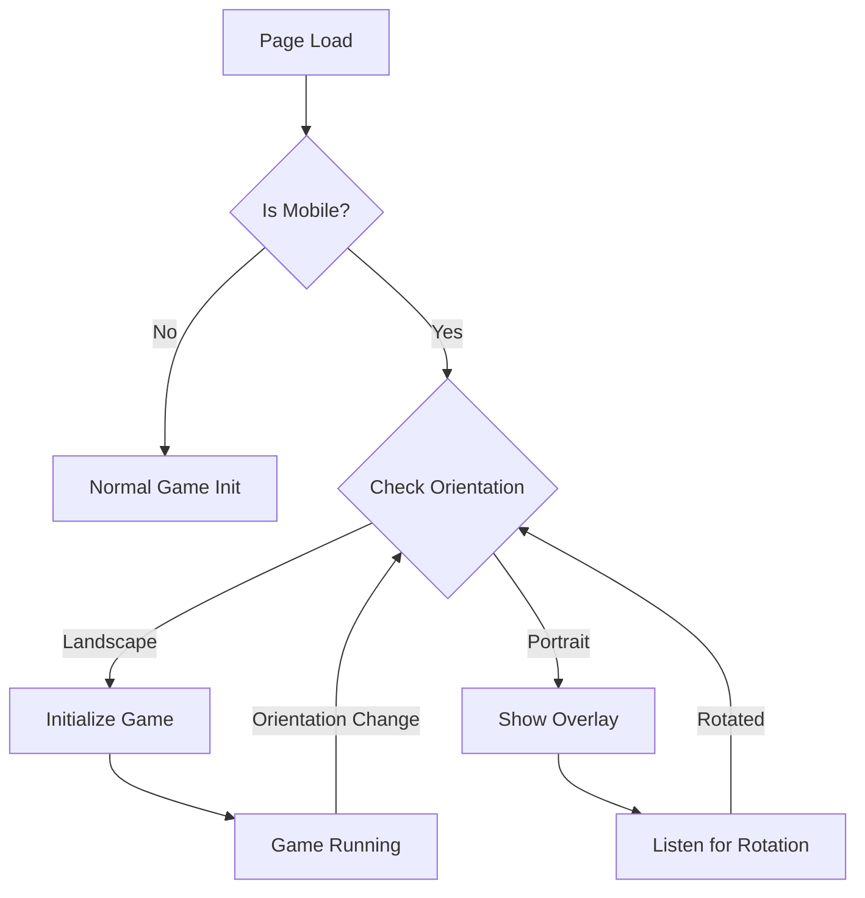
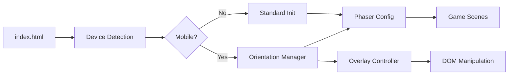

# Mobile Horizontal Layout - Technical Design

## Architecture Overview

The mobile horizontal layout implementation will enhance the existing Phaser 3 game to support mobile devices in landscape orientation while maintaining full desktop compatibility. The solution uses Phaser's built-in scale manager with custom orientation detection and overlay management.

## Core Components

### 1. Device Detection Service

```javascript
window.DeviceDetectionService = {
  isMobile: function() {
    // Primary detection via user agent
    // Secondary detection via touch capability
    // Viewport width threshold check (<768px)
  },
  
  getOrientation: function() {
    // Returns 'portrait' or 'landscape'
    // Uses window.orientation and matchMedia
  },
  
  isIOS: function() {
    // Detect iOS for specific handling
  },
  
  isAndroid: function() {
    // Detect Android for specific handling
  }
}
```

### 2. Phaser Scale Manager Configuration

**Location**: `src/config/GameConfig.js`

```javascript
scale: {
  mode: Phaser.Scale.FIT,
  parent: 'game-container',
  width: 1920,
  height: 1080,
  autoCenter: Phaser.Scale.CENTER_BOTH,
  // Letterboxing handled automatically by FIT mode
}
```

**Key Decisions**:
- Use `FIT` mode to maintain aspect ratio with letterboxing
- Fixed 1920x1080 resolution for consistent gameplay
- Auto-center for optimal viewing on all screens

### 3. Orientation Overlay System



**Overlay Structure**:
```html
<div id="orientation-overlay">
  <div class="overlay-content">
    <div class="rotate-icon-container">
      <!-- Animated SVG phone icon -->
    </div>
    <h2>Please Rotate Your Device</h2>
    <p>This game is best experienced in landscape mode</p>
  </div>
</div>
```

**CSS Architecture**:
- Position: fixed, full viewport coverage
- Z-index: 10000 (above game canvas)
- Background: Semi-transparent dark overlay
- Animation: CSS keyframes for rotating phone icon
- Responsive: Scales based on viewport size

### 4. Touch Input Handling

**Coordinate Mapping Strategy**:
```javascript
// In Phaser input handlers
adjustTouchCoordinates(pointer) {
  // Phaser handles this automatically with scale manager
  // pointer.x and pointer.y are already in game coordinates
  // No manual transformation needed with FIT scaling
}
```

**Touch Event Configuration**:
- Enable multi-touch support for gesture recognition
- Adjust tap/click thresholds for mobile
- Implement touch-friendly hit areas (minimum 44x44px)

### 5. Scene Modifications

**LoadingScene Updates**:
- Early device detection
- Initialize orientation monitoring
- Pre-create overlay DOM elements

**MenuScene Updates**:
- Larger button hit areas for mobile
- Touch-optimized UI layout
- Responsive text sizing

**GameScene Updates**:
- Touch gesture support for spin action
- Mobile-optimized UI controls
- Maintain existing desktop mouse/keyboard handlers

### 6. Integration Points



### 7. State Management

**Orientation State Tracking**:
```javascript
window.OrientationManager = {
  currentOrientation: 'unknown',
  overlayVisible: false,
  gameInitialized: false,
  
  handleOrientationChange() {
    // Update state
    // Toggle overlay
    // Pause/resume game
    // Dispatch custom events
  }
}
```

### 8. Event Flow

1. **Initial Load**:
   - Detect device type
   - Check current orientation
   - Show overlay if portrait on mobile
   - Initialize game if landscape or desktop

2. **Orientation Change**:
   - Capture orientationchange/resize events
   - Update orientation state
   - Show/hide overlay
   - Pause/resume game appropriately

3. **Game Interaction**:
   - Touch events mapped to game coordinates
   - Existing click handlers work unchanged
   - Phaser handles coordinate transformation

## Performance Considerations

1. **Overlay Rendering**:
   - Use CSS transforms for animations (GPU accelerated)
   - Minimize DOM manipulation
   - Cache DOM references

2. **Game Scaling**:
   - Phaser's FIT mode is optimized
   - No manual canvas scaling needed
   - Letterboxing adds minimal overhead

3. **Event Handling**:
   - Debounce resize/orientation events
   - Use passive event listeners where appropriate
   - Remove listeners when not needed

## Browser Compatibility

- **iOS Safari**: 12+ (orientation API, touch events)
- **Android Chrome**: 80+ (modern orientation API)
- **Mobile Firefox**: Supported
- **Desktop Browsers**: Unchanged functionality

## Testing Strategy

1. **Device Testing Matrix**:
   - iPhone (various models)
   - Android phones (various screen sizes)
   - iPad/Android tablets
   - Desktop browsers (unchanged)

2. **Orientation Scenarios**:
   - Start in portrait → rotate to landscape
   - Start in landscape → rotate to portrait
   - Rapid orientation changes
   - Browser refresh in each orientation

3. **Touch Input Validation**:
   - Symbol selection accuracy
   - Button tap responsiveness
   - Gesture recognition
   - Multi-touch handling

## Future Extensibility

The architecture supports future vertical mode by:
- Modular orientation detection system
- Configurable scale modes
- Separate overlay management
- Scene-based layout switching
- Independent touch handling layer

This design maintains backward compatibility while adding comprehensive mobile support, setting the foundation for potential future enhancements like vertical gameplay mode.